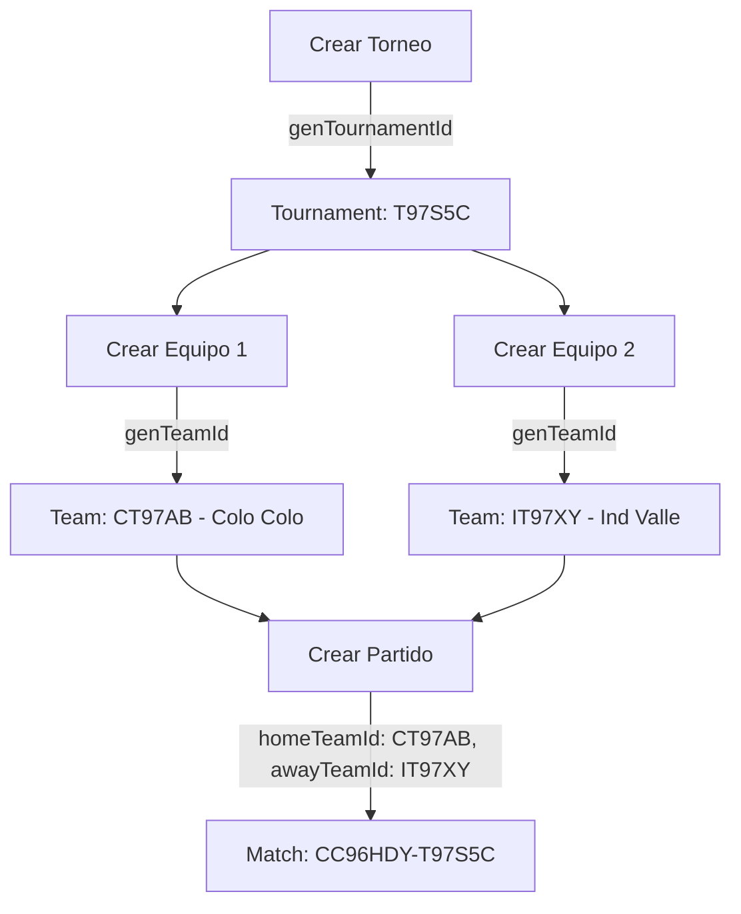

# Team Analytics Mapping - Guía de Implementación

## 📋 Resumen

Este documento explica cómo estructurar los datos de torneos, equipos, partidos y analytics para que cada jugador pueda ver **SOLO los datos de SU equipo** en el panel de analytics.

---

## 🔍 Problema Identificado

### Situación Actual

1. **Equipos** usan IDs autogenerados por Firestore (largo y no descriptivo)
2. **Analytics** se almacenan con claves `home`/`away` sin referencia explícita al `teamId`
3. **No hay forma directa** de saber qué equipo (`teamId`) corresponde a `home` o `away` en analytics

### Ejemplo del Problema

```typescript
// Match en Firestore
{
  id: "CC96HDY-T97S5C",
  homeTeamId: { id: "AbC123XyZ456...", name: "Colo Colo" },
  awayTeamId: { id: "DeF789GhI012...", name: "Ind Valle" }
}

// Analytics en Firestore
tournaments/T97S5C/matches/CC96HDY-T97S5C/
  ├── stats/home    → ¿Cómo saber que esto es "AbC123XyZ456..."?
  └── stats/away    → ¿Cómo saber que esto es "DeF789GhI012..."?
```

**Pregunta clave**: ¿Cómo determinar si el jugador es `home` o `away`?

---

## 🔍 **DESCUBRIMIENTO IMPORTANTE: Metadata del Partido**

### Estructura Real en Firestore

La estructura en Firestore ya contiene la metadata necesaria:

```
tournaments/{tournamentId}/matches/{matchId}
  ├── (documento con homeTeamId y awayTeamId)  ← METADATA DISPONIBLE
  └── subcollections:
      ├── stats/home
      ├── stats/away
      ├── shotMaps/home
      ├── shotMaps/away
      ├── heatMaps/home
      ├── heatMaps/away
      └── ...
```

**Acceso a la metadata:**

```typescript
// El documento padre ya contiene:
{
  id: "CC96HDY-T97S5C",
  tournamentId: "T97S5C",
  homeTeamId: { id: "team123", name: "Colo Colo" },
  awayTeamId: { id: "team456", name: "Ind Valle" },
  date: 1705334400000,
  status: "terminado",
  score: { home: 2, away: 1 }
}
```

### Ventaja Clave

✅ **NO necesitamos agregar `teamId` en cada documento de analytics**
✅ La metadata del partido YA tiene `homeTeamId` y `awayTeamId`
✅ Podemos acceder al documento padre desde cualquier servicio

---

## ✅ Soluciones Implementadas

### Solución 1: Usar Metadata Existente del Partido (RECOMENDADA)

Acceder al documento padre del partido para obtener `homeTeamId` y `awayTeamId`.

#### Implementación

**Archivo**: `src/services/matchMetadataService.ts` (NUEVO)

```typescript
import { db } from '@/boot/firebase'
import { doc, getDoc } from 'firebase/firestore'

export interface MatchMetadata {
  id: string
  tournamentId: string
  homeTeamId: { id: string; name: string }
  awayTeamId: { id: string; name: string }
  date?: number
  status?: string
  score?: { home: number; away: number }
}

/**
 * Obtiene la metadata del partido desde Firestore
 */
export async function getMatchMetadata(
  tournamentId: string,
  matchId: string
): Promise<MatchMetadata | null> {
  try {
    const matchRef = doc(db, 'tournaments', tournamentId, 'matches', matchId)
    const matchSnap = await getDoc(matchRef)

    if (!matchSnap.exists()) {
      console.warn(`Match not found: ${matchId}`)
      return null
    }

    return { id: matchSnap.id, ...matchSnap.data() } as MatchMetadata
  } catch (error) {
    console.error('Error:', error)
    throw error
  }
}

/**
 * Determina si un teamId corresponde a 'home' o 'away'
 */
export function determineTeamSide(
  matchMetadata: MatchMetadata,
  teamId: string
): 'home' | 'away' | null {
  if (matchMetadata.homeTeamId.id === teamId) return 'home'
  if (matchMetadata.awayTeamId.id === teamId) return 'away'
  return null
}
```

**Ventajas**:
- ✅ No requiere modificar documentos de analytics existentes
- ✅ Un solo punto de consulta para obtener metadata
- ✅ Reutilizable en toda la aplicación
- ✅ Mantiene los analytics "ligeros" sin duplicar información

---

### Solución 2: IDs Descriptivos para Equipos (OPCIONAL)

Cambiar de IDs autogenerados a IDs descriptivos y cortos.

#### Implementación

**Archivo**: `src/utils/id.ts`

```typescript
/**
 * Genera ID descriptivo para equipos
 * Formato: [InicialEquipo][3CharsDelTorneo][2CharsRandom]
 * Ejemplo: "CT97AB" para "Colo Colo" en torneo "T97S5C"
 */
export function genTeamId(teamName: string, tournamentId: string): string {
  const initial = firstAlpha(teamName)                    // 1 char: "C"
  const tournamentPart = tournamentId.slice(0, 3)          // 3 chars: "T97"
  const random = toB36(Math.floor(Math.random() * 1296), 2) // 2 chars: "AB"
  return `${initial}${tournamentPart}${random}`            // "CT97AB"
}
```

**Ejemplos**:
- `"Colo Colo"` en torneo `"T97S5C"` → `"CT97AB"`
- `"Ind Valle"` en torneo `"T97S5C"` → `"IT97XY"`
- `"Barcelona"` en torneo `"B8CD9E"` → `"BB8CZQ"`

**Ventajas**:
- ✅ IDs más cortos (6 chars vs 20+)
- ✅ Fácil de identificar el torneo
- ✅ Primera letra identifica el equipo
- ✅ Sigue siendo único (random al final)

---

### Solución 2: Agregar `teamId` en Analytics

Modificar los documentos de analytics para incluir el `teamId` de Firestore.

#### Estructura Actual

```typescript
// tournaments/{tournamentId}/matches/{matchId}/stats/home
{
  team: "Colo Colo",
  stats: [...]
}
```

#### Estructura Mejorada

```typescript
// tournaments/{tournamentId}/matches/{matchId}/stats/home
{
  team: "Colo Colo",
  teamId: "CT97AB",        // ← NUEVO: ID del equipo en Firestore
  stats: [...]
}

// tournaments/{tournamentId}/matches/{matchId}/stats/away
{
  team: "Ind Valle",
  teamId: "IT97XY",        // ← NUEVO: ID del equipo en Firestore
  stats: [...]
}
```

**Aplicar a todos los documentos de analytics**:
- ✅ `stats/home` y `stats/away`
- ✅ `shotMaps/home` y `shotMaps/away`
- ✅ `heatMaps/home` y `heatMaps/away`
- ✅ `locationMaps/home` y `locationMaps/away`
- ✅ `passesStrings/home` y `passesStrings/away`

#### Implementación

Cuando subes analytics desde VEO, agregar el campo `teamId`:

```typescript
// En gol360-api o donde proceses los datos de VEO
import { getMatch } from './matchService'

async function uploadMatchAnalytics(tournamentId: string, matchId: string, analyticsData: any) {
  // 1. Obtener información del partido
  const match = await getMatch(matchId)

  // 2. Subir analytics con teamId
  await setDoc(
    doc(db, 'tournaments', tournamentId, 'matches', matchId, 'stats', 'home'),
    {
      team: match.homeTeamId.name,
      teamId: match.homeTeamId.id,    // ← AGREGAR
      stats: analyticsData.home.stats
    }
  )

  await setDoc(
    doc(db, 'tournaments', tournamentId, 'matches', matchId, 'stats', 'away'),
    {
      team: match.awayTeamId.name,
      teamId: match.awayTeamId.id,    // ← AGREGAR
      stats: analyticsData.away.stats
    }
  )
}
```

---

### Solución 3: Servicio de Mapeo de Equipos

Crear servicios para determinar el lado (`home`/`away`) del jugador.

#### Archivo: `src/services/playerParticipationService.ts`

```typescript
import { db } from '@/boot/firebase'
import { collection, query, where, getDocs, limit } from 'firebase/firestore'
import type { PlayerParticipation } from '@/types/auth'
import type { Match } from '@/types/competition'

/**
 * Obtiene la participación de un jugador en un torneo
 * Retorna el teamId del jugador
 */
export async function getPlayerParticipation(
  playerId: string,
  tournamentId: string
): Promise<PlayerParticipation | null> {
  const q = query(
    collection(db, 'playerParticipations'),
    where('playerId', '==', playerId),
    where('tournamentId', '==', tournamentId),
    where('active', '==', true),
    limit(1)
  )

  const snapshot = await getDocs(q)
  if (snapshot.empty) return null

  return {
    id: snapshot.docs[0].id,
    ...snapshot.docs[0].data()
  } as PlayerParticipation
}

/**
 * Determina si el jugador es 'home' o 'away' en un partido
 * Compara el teamId del jugador con homeTeamId y awayTeamId del match
 */
export function determinePlayerSide(
  match: Match,
  playerTeamId: string
): 'home' | 'away' | null {
  if (match.homeTeamId.id === playerTeamId) return 'home'
  if (match.awayTeamId.id === playerTeamId) return 'away'
  return null  // El jugador no participó en este partido
}
```

---

## 🔄 Flujo de Datos Completo

### 1. Creación de Estructura



### 2. Asignación de Jugadores

```typescript
// Jugador se registra en el torneo y equipo
await addDoc(collection(db, 'playerParticipations'), {
  playerId: "player123",      // UID del jugador
  tournamentId: "T97S5C",     // ID del torneo
  teamId: "CT97AB",           // ID del equipo (Colo Colo)
  jersey: 10,
  position: "Delantero",
  active: true
})
```

### 3. Carga de Analytics desde VEO

```typescript
// Cuando VEO procesa el partido y genera analytics
const match = await getMatch("CC96HDY-T97S5C")

// Subir analytics con teamId
await setDoc(doc(db, 'tournaments/T97S5C/matches/CC96HDY-T97S5C/stats/home'), {
  team: "Colo Colo",
  teamId: "CT97AB",           // ← Identifica el equipo
  stats: [...]
})

await setDoc(doc(db, 'tournaments/T97S5C/matches/CC96HDY-T97S5C/stats/away'), {
  team: "Ind Valle",
  teamId: "IT97XY",           // ← Identifica el equipo
  stats: [...]
})
```

### 4. Vista del Jugador en Analytics

```typescript
// En TournamentStats.vue cuando el jugador entra
const userRole = databaseStore.userData?.role

if (userRole === 'player') {
  // 1. Obtener teamId del jugador
  const playerId = userStore.user?.uid
  const participation = await getPlayerParticipation(playerId, tournamentId)
  const playerTeamId = participation.teamId  // "CT97AB"

  // 2. Obtener el partido seleccionado
  const match = await getMatch(selectedMatch.matchId)

  // 3. Determinar si es home o away
  const playerSide = determinePlayerSide(match, playerTeamId)  // "home"

  // 4. Cargar analytics
  const data = await getAllMatchAnalytics(tournamentId, matchId)

  // 5. Filtrar SOLO los datos del equipo del jugador
  analyticsData.value = {
    tournamentId,
    matchId,
    [playerSide]: data[playerSide],  // Solo 'home', no 'away'
    data: {
      playerMoments: data.playerMoments.filter(pm => pm.side === playerSide),
      highlights: data.highlights.filter(h => h.side === playerSide)
    }
  }
}
```

---

## 📊 Estructura de Datos

### Colección: `tournaments`

```typescript
{
  id: "auto-generated-doc-id",
  tournamentId: "T97S5C",          // ID legible generado
  displayName: "GOL360 Cup 2025",
  managerId: "manager123",
  // ...otros campos
}
```

### Colección: `teams`

```typescript
{
  id: "CT97AB",                    // ID customizado (genTeamId)
  tournamentId: "T97S5C",
  displayName: "Colo Colo",
  city: "Santiago",
  crestUrl: "https://...",
  createdBy: "manager123",
  // ...otros campos
}
```

### Colección: `playerParticipations`

```typescript
{
  id: "auto-generated-doc-id",
  playerId: "player123",           // UID del jugador
  tournamentId: "T97S5C",
  teamId: "CT97AB",                // Relaciona jugador con equipo
  jersey: 10,
  position: "Delantero",
  active: true,
  // ...otros campos
}
```

### Colección: `matches`

```typescript
{
  id: "CC96HDY-T97S5C",            // ID generado (genMatchId + tournamentId)
  tournamentId: "T97S5C",
  homeTeamId: {
    id: "CT97AB",                  // Referencia al equipo
    name: "Colo Colo"
  },
  awayTeamId: {
    id: "IT97XY",
    name: "Ind Valle"
  },
  date: 1705334400000,
  status: "terminado",
  score: { home: 2, away: 1 },
  // ...otros campos
}
```

### Subcolección: `tournaments/{tournamentId}/matches/{matchId}/stats/{side}`

```typescript
// stats/home
{
  team: "Colo Colo",
  teamId: "CT97AB",                // ← NUEVO: Vincula con collection teams
  stats: [
    { name: "Goals", home: 2, away: 1 },
    { name: "Shots", home: 15, away: 8 },
    // ...más stats
  ],
  updatedAt: Timestamp
}

// stats/away
{
  team: "Ind Valle",
  teamId: "IT97XY",                // ← NUEVO: Vincula con collection teams
  stats: [
    { name: "Goals", home: 2, away: 1 },
    { name: "Shots", home: 15, away: 8 },
    // ...más stats
  ],
  updatedAt: Timestamp
}
```

---

## 🎯 Roles y Permisos

### Admin / Manager
- ✅ Ve **TODOS** los equipos (home Y away)
- ✅ Puede cambiar entre equipos con toggle
- ✅ Accede a todos los partidos del torneo

### Player
- ✅ Ve **SOLO** los datos de SU equipo
- ❌ No ve toggle de equipos (auto-seleccionado)
- ✅ Solo ve partidos donde SU equipo participó

### Team (Capitán)
- ✅ Ve **SOLO** los datos de SU equipo
- ❌ No ve toggle de equipos
- ✅ Mismo comportamiento que Player

---

## 🔧 Cambios en Código

### 1. Actualizar `teamService.ts`

```typescript
// src/services/teamService.ts
import { genTeamId } from '@/utils/id'

export async function createTeam(
  payload: Omit<Team, 'id' | 'createdAt' | 'createdBy'>,
  ctx: { uid: string }
): Promise<string> {
  // Generar ID customizado
  const teamId = genTeamId(payload.displayName, payload.tournamentId)
  const ref = doc(colTeams, teamId)  // ← Usar ID customizado

  // Verificar si ya existe (en caso de colisión)
  const existing = await getDoc(ref)
  if (existing.exists()) {
    // Regenerar con nuevo random
    return createTeam(payload, ctx)
  }

  const data: Team = {
    id: teamId,
    tournamentId: payload.tournamentId,
    displayName: payload.displayName,
    city: payload.city ?? '',
    group: payload.group ?? '',
    colors: payload.colors ?? '',
    crestUrl: payload.crestUrl ?? '',
    captainId: payload.captainId ?? '',
    createdBy: ctx.uid,
    createdAt: serverTimestamp()
  }

  await setDoc(ref, data)
  return teamId
}
```

### 2. Actualizar tipos en `matchAnalyticsService.ts`

```typescript
// src/services/matchAnalyticsService.ts

export interface MatchStats {
  team: string
  teamId: string           // ← NUEVO: Agregar
  stats: Array<{
    name: string
    home: string | number
    away: string | number
  }>
  updatedAt: Date
}

export interface ShotMapData {
  team: string
  teamId: string           // ← NUEVO: Agregar
  data: Record<string, ShotMapPeriod>
  updatedAt: Date
}

export interface HeatMapData {
  team: string
  teamId: string           // ← NUEVO: Agregar
  data: Record<string, HeatMapPeriod>
  updatedAt: Date
}

export interface PassesStringsData {
  team: string
  teamId: string           // ← NUEVO: Agregar
  data: Record<string, PassesStringsPeriod>
  updatedAt: Date
}
```

### 3. Crear `playerParticipationService.ts`

```typescript
// src/services/playerParticipationService.ts
// (Ver código completo en Solución 3 arriba)
```

### 4. Actualizar `TournamentStats.vue`

```typescript
// src/pages/tournaments/TournamentStats.vue

import { getPlayerParticipation, determinePlayerSide } from '@/services/playerParticipationService'
import { useDatabaseStore } from '@/stores/database'
import { useUserStore } from '@/stores/user'

async function loadAnalytics() {
  if (!selectedMatch.value) return

  const userRole = databaseStore.userData?.role
  let playerSide: 'home' | 'away' | null = null

  // Determinar el lado del jugador si es rol 'player' o 'team'
  if (userRole === 'player' || userRole === 'team') {
    const playerId = userStore.user?.uid

    if (!playerId) {
      Notify.create({
        type: 'warning',
        message: 'No se pudo identificar tu usuario',
        position: 'top'
      })
      return
    }

    const participation = await getPlayerParticipation(playerId, tId.value)

    if (!participation) {
      Notify.create({
        type: 'warning',
        message: 'No estás registrado en este torneo',
        position: 'top'
      })
      return
    }

    // Buscar el match completo para obtener homeTeamId y awayTeamId
    const match = mStore.items.find(m => m.id === selectedMatch.value?.matchId)

    if (!match) {
      Notify.create({
        type: 'warning',
        message: 'No se encontró información del partido',
        position: 'top'
      })
      return
    }

    playerSide = determinePlayerSide(match, participation.teamId)

    if (!playerSide) {
      Notify.create({
        type: 'info',
        message: 'Tu equipo no participó en este partido',
        position: 'top'
      })
      return
    }
  }

  isLoadingAnalytics.value = true
  try {
    const data = await getAllMatchAnalytics(
      selectedMatch.value.tournamentId,
      selectedMatch.value.matchId
    )

    // Filtrar según el rol
    if (playerSide) {
      // SOLO mostrar datos del equipo del jugador
      analyticsData.value = {
        tournamentId: selectedMatch.value.tournamentId,
        matchId: selectedMatch.value.matchId,
        [playerSide]: data[playerSide],  // Solo un equipo
        data: {
          playerMoments: data.playerMoments.filter(pm => pm.side === playerSide),
          highlights: data.highlights.filter(h => h.side === playerSide)
        }
      }

      console.log(`[Player View] Showing only ${playerSide} team data:`, analyticsData.value)
    } else {
      // Admins/Managers ven TODOS los equipos
      analyticsData.value = {
        tournamentId: selectedMatch.value.tournamentId,
        matchId: selectedMatch.value.matchId,
        home: data.home,
        away: data.away,
        data: {
          playerMoments: data.playerMoments,
          highlights: data.highlights
        }
      }

      console.log('[Admin/Manager View] Showing both teams data:', analyticsData.value)
    }
  } catch (error) {
    console.error('Error loading analytics:', error)
    Notify.create({
      type: 'warning',
      message: 'No hay datos de analytics disponibles para este partido',
      position: 'top'
    })
    analyticsData.value = null
  } finally {
    isLoadingAnalytics.value = false
  }
}
```

### 5. Actualizar `AnalyticsPanel.vue`

```typescript
// src/components/tournaments/panels/AnalyticsPanel.vue

// El computed showTeamSelector ya detecta automáticamente
const showTeamSelector = computed(() => {
  const hasHome = props.analyticsData && 'home' in props.analyticsData
  const hasAway = props.analyticsData && 'away' in props.analyticsData

  // Solo mostrar toggle si hay ambos equipos (Admin/Manager)
  return hasHome && hasAway
})

// Si solo hay 'home' o 'away', auto-seleccionar ese equipo
watch(() => props.analyticsData, (newData) => {
  if (newData) {
    const hasHome = 'home' in newData
    const hasAway = 'away' in newData

    if (hasHome && !hasAway) {
      selectedTeam.value = 'home'  // Solo tiene home, auto-seleccionar
    } else if (hasAway && !hasHome) {
      selectedTeam.value = 'away'  // Solo tiene away, auto-seleccionar
    } else if (hasHome && hasAway) {
      selectedTeam.value = 'home'  // Tiene ambos, default a home
    }
  }
}, { deep: true, immediate: true })
```

---

## 📝 Checklist de Implementación

### Fase 1: IDs de Equipos
- [ ] Agregar función `genTeamId()` en `src/utils/id.ts`
- [ ] Modificar `createTeam()` en `src/services/teamService.ts`
- [ ] Probar creación de equipos con nuevos IDs
- [ ] Verificar que IDs sean únicos y descriptivos

### Fase 2: Analytics con teamId
- [ ] Actualizar interfaces en `src/services/matchAnalyticsService.ts`
- [ ] Modificar el código de carga de analytics desde VEO para incluir `teamId`
- [ ] Verificar que todos los documentos de analytics tengan `teamId`:
  - [ ] `stats/home` y `stats/away`
  - [ ] `shotMaps/home` y `shotMaps/away`
  - [ ] `heatMaps/home` y `heatMaps/away`
  - [ ] `locationMaps/home` y `locationMaps/away`
  - [ ] `passesStrings/home` y `passesStrings/away`

### Fase 3: Servicios de Mapeo
- [ ] Crear `src/services/playerParticipationService.ts`
- [ ] Implementar `getPlayerParticipation()`
- [ ] Implementar `determinePlayerSide()`
- [ ] Crear tests unitarios para ambas funciones

### Fase 4: Integración en UI
- [ ] Modificar `TournamentStats.vue` para detectar rol del usuario
- [ ] Implementar filtrado de datos según el lado del jugador
- [ ] Actualizar `AnalyticsPanel.vue` para ocultar toggle cuando solo hay un equipo
- [ ] Verificar que admin/manager sigan viendo ambos equipos
- [ ] Verificar que player/team solo vean su equipo

### Fase 5: Testing
- [ ] Probar flujo completo como Admin
- [ ] Probar flujo completo como Manager
- [ ] Probar flujo completo como Player
- [ ] Probar flujo completo como Team (Capitán)
- [ ] Verificar que jugador no vea datos del equipo contrario
- [ ] Verificar mensajes de error cuando jugador no está en el torneo

---

## 🚨 Consideraciones Importantes

### 1. Migración de Datos Existentes

Si ya tienes equipos con IDs autogenerados:

```typescript
// Script de migración (ejecutar una sola vez)
async function migrateTeamIds() {
  const teams = await getDocs(collection(db, 'teams'))

  for (const teamDoc of teams.docs) {
    const team = teamDoc.data()
    const newTeamId = genTeamId(team.displayName, team.tournamentId)

    // Crear nuevo documento con ID customizado
    await setDoc(doc(db, 'teams', newTeamId), {
      ...team,
      id: newTeamId
    })

    // Actualizar referencias en playerParticipations
    const participations = await getDocs(
      query(collection(db, 'playerParticipations'), where('teamId', '==', teamDoc.id))
    )

    for (const partDoc of participations.docs) {
      await updateDoc(doc(db, 'playerParticipations', partDoc.id), {
        teamId: newTeamId
      })
    }

    // Actualizar referencias en matches
    const matches = await getDocs(
      query(
        collection(db, 'matches'),
        where('tournamentId', '==', team.tournamentId)
      )
    )

    for (const matchDoc of matches.docs) {
      const match = matchDoc.data()
      const updates: any = {}

      if (match.homeTeamId.id === teamDoc.id) {
        updates['homeTeamId.id'] = newTeamId
      }
      if (match.awayTeamId.id === teamDoc.id) {
        updates['awayTeamId.id'] = newTeamId
      }

      if (Object.keys(updates).length > 0) {
        await updateDoc(doc(db, 'matches', matchDoc.id), updates)
      }
    }

    // Eliminar documento antiguo
    await deleteDoc(doc(db, 'teams', teamDoc.id))
  }
}
```

### 2. Validación de Datos

Siempre validar que:
- ✅ El jugador tenga una `playerParticipation` activa
- ✅ El `teamId` del jugador coincida con `homeTeamId` o `awayTeamId` del match
- ✅ Los analytics tengan el campo `teamId`

### 3. Manejo de Errores

```typescript
// Ejemplo de manejo de errores robusto
async function loadPlayerAnalytics(playerId: string, tournamentId: string, matchId: string) {
  try {
    // 1. Validar participación
    const participation = await getPlayerParticipation(playerId, tournamentId)
    if (!participation) {
      throw new Error('PLAYER_NOT_IN_TOURNAMENT')
    }

    // 2. Obtener match
    const match = await getMatch(matchId)
    if (!match) {
      throw new Error('MATCH_NOT_FOUND')
    }

    // 3. Determinar lado
    const playerSide = determinePlayerSide(match, participation.teamId)
    if (!playerSide) {
      throw new Error('TEAM_NOT_IN_MATCH')
    }

    // 4. Cargar analytics
    const data = await getAllMatchAnalytics(tournamentId, matchId)
    if (!data[playerSide]) {
      throw new Error('NO_ANALYTICS_DATA')
    }

    return { data: data[playerSide], side: playerSide }

  } catch (error) {
    if (error instanceof Error) {
      switch (error.message) {
        case 'PLAYER_NOT_IN_TOURNAMENT':
          Notify.create({ type: 'warning', message: 'No estás registrado en este torneo' })
          break
        case 'MATCH_NOT_FOUND':
          Notify.create({ type: 'warning', message: 'Partido no encontrado' })
          break
        case 'TEAM_NOT_IN_MATCH':
          Notify.create({ type: 'info', message: 'Tu equipo no jugó en este partido' })
          break
        case 'NO_ANALYTICS_DATA':
          Notify.create({ type: 'info', message: 'No hay datos de analytics disponibles' })
          break
        default:
          Notify.create({ type: 'negative', message: 'Error al cargar analytics' })
      }
    }
    throw error
  }
}
```

---

## 📚 Referencias

- [Generación de IDs](../src/utils/id.ts)
- [Servicio de Equipos](../src/services/teamService.ts)
- [Servicio de Partidos](../src/services/matchService.ts)
- [Servicio de Analytics](../src/services/matchAnalyticsService.ts)
- [Tipos de Competición](../src/types/competition.ts)
- [Tipos de Autenticación](../src/types/auth.d.ts)

---

## 📧 Contacto

Para dudas o sugerencias sobre esta implementación, consultar con el equipo de desarrollo.

---

**Última actualización**: 2025-01-23
**Versión**: 1.0.0
